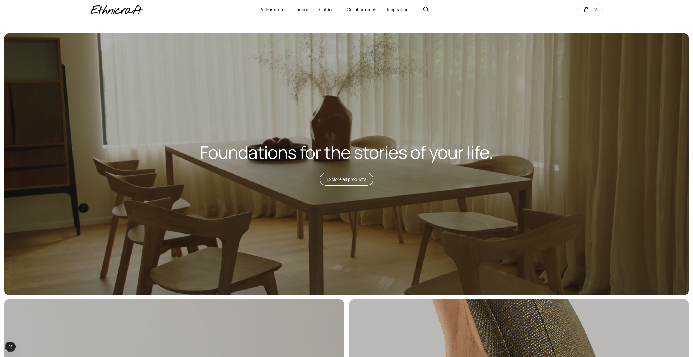
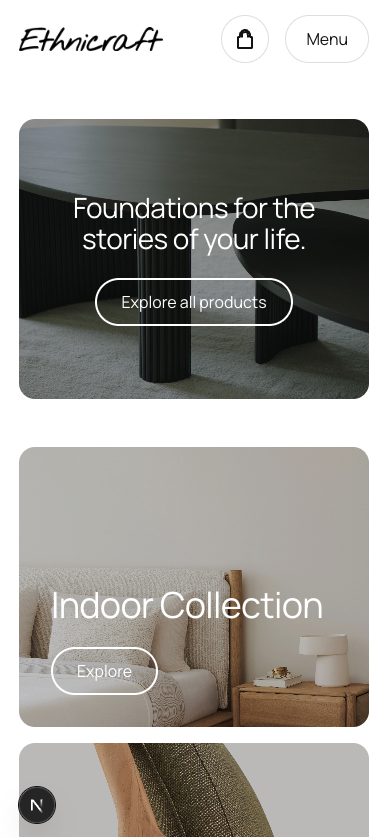
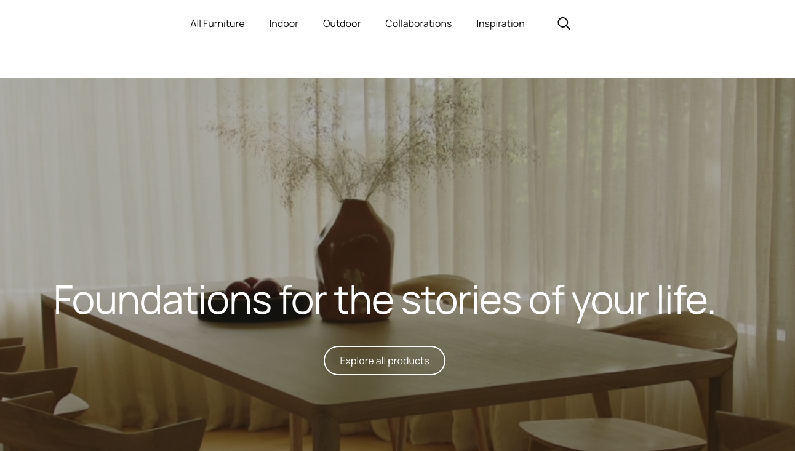
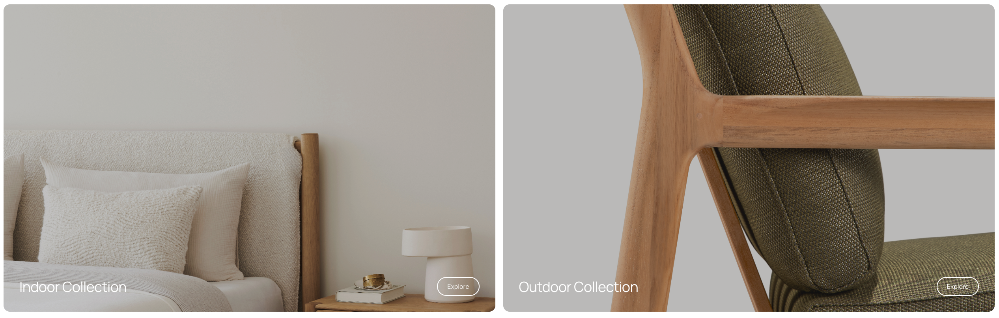
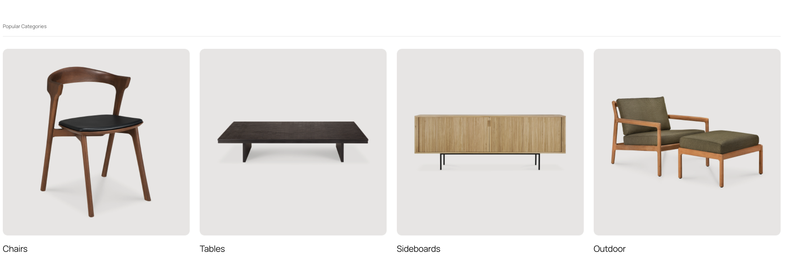
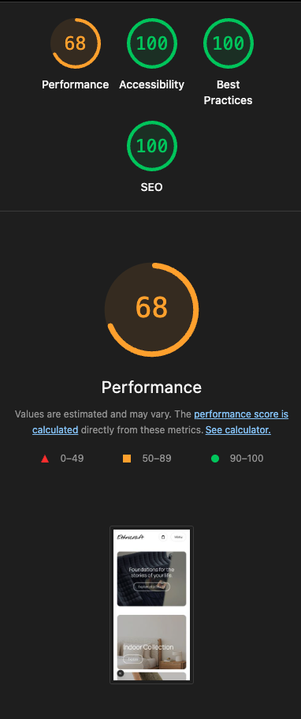

 # ETHNICRAFT — Premium Brand Website

 Premium responsive brand website focused on modern UX/UI, visual storytelling, and high-end frontend implementation.

 ## Overview

 **ETHNICRAFT** is a portfolio-grade marketing website for a premium furniture brand. The project is built with a Figma-to-code mindset: design decisions are translated into a consistent UI system (tokens + reusable components) and assembled into visually rich sections that work beautifully across screen sizes.

 The goal is not just “a homepage”, but a **polished product-like frontend** that communicates brand quality through layout, typography, spacing, and motion-ready composition.

 ## Features

 - **Responsive layouts**
 - **Premium UI/UX** (typography-first, whitespace, hierarchy, high-end feel)
 - **Figma-to-code workflow**
 - **Reusable components** for consistent sections and iteration speed
 - **Modern frontend architecture** (Next.js App Router)
 - **Visual storytelling sections** (hero, editorial content blocks, brand moments)
 - **Mobile-first responsiveness**

 ## Tech Stack

 Detected from `package.json`:

 - **Framework**: Next.js (App Router) (`next`)
 - **UI**: React (`react`, `react-dom`)
 - **Language**: TypeScript
 - **Styling**: Tailwind CSS (v4) + PostCSS
 - **Linting**: ESLint (`eslint-config-next`)

 ## Development Status

 This project is **in active development**. UI sections, polish, and content are being iterated to match the intended premium brand direction.

 ## Screenshots

 Add screenshots to make this repository portfolio-ready.

 ### Recommended folder structure

 Create this path in the project root:

 ```txt
 assets/
   screenshots/
 ```

 Place images here:

 - `assets/screenshots/`

 ### Recommended filenames

 Use clear, ordered names so the README stays stable over time:

 - `01-home-desktop.png`
 - `02-home-mobile.png`
 - `03-hero-detail.png`
 - `04-home-popular-categories.png`
 - `05-home-desktop-collections.png`
 - `06-lighthouse.png`

 ### Screenshot placeholders

 Replace the placeholders below after adding images to `assets/screenshots/`.

 #### Desktop — Home

 

 #### Mobile — Home

 

 #### UI Detail — Hero / Typography

 

 #### UI Detail — Section

 

 #### Components / System

 

 #### Performance / Quality

 

 ## Getting Started

 ### Installation

 ```bash
 npm install
 ```

 ### Run locally

 ```bash
 npm run dev
 ```

 Then open:

 - `http://localhost:3000`

 ### Build

 ```bash
 npm run build
 npm run start
 ```

 ## Project Structure (high level)

 ```txt
 src/
   app/            # Next.js App Router pages/layouts
   components/     # Reusable UI components
 public/           # Static assets (images, icons, etc.)
 assets/
   screenshots/    # Portfolio screenshots referenced by this README
 ```

 ## Deployment Readiness (not deploying yet)

 The repository includes standard Next.js scripts (`dev`, `build`, `start`) and can be deployed later to platforms like **Vercel**.

 If/when you decide to deploy, ensure:

 - all images/fonts are optimized and correctly referenced
 - environment variables (if any) are documented
 - Lighthouse metrics are captured for the README

 ## Future Improvements

 - Add additional pages (collection, product, about) to showcase navigation and scalability
 - Improve motion (subtle transitions, scroll-based reveals) while maintaining performance
 - Add accessibility checks (keyboard navigation, focus states, color contrast)
 - Add a small “design system” page or Storybook-style component showcase